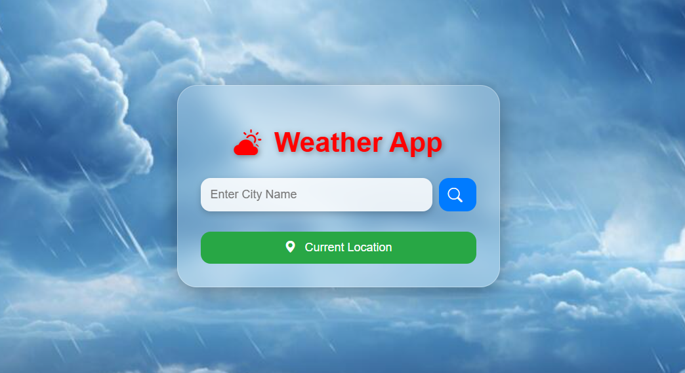
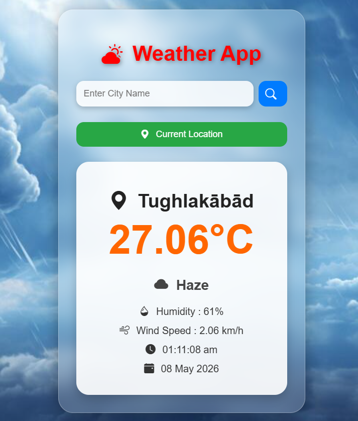
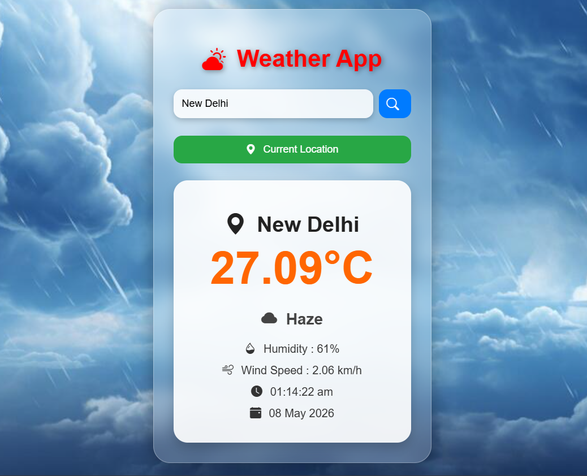

# Weather App using Django

A real-time weather web application developed using Django and OpenWeather API.

## Features
- Real-time weather updates
- City search functionality
- Temperature, humidity, and wind details
- Responsive UI

## Technologies Used
- Python
- Django
- HTML
- CSS
- Javascript
- Bootstrap
- OpenWeather API

  ## Screenshot

## Author
Sachin Kumar

### LinkedIn
[LinkedIn Profile](https://www.linkedin.com/in/sachin-kumar-362b53343/)

### GitHub
[GitHub](https://github.com/SACHIN197-creator)

---

